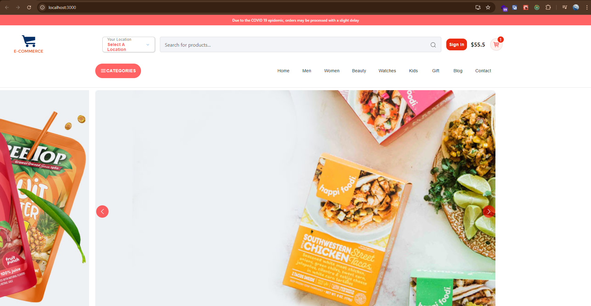
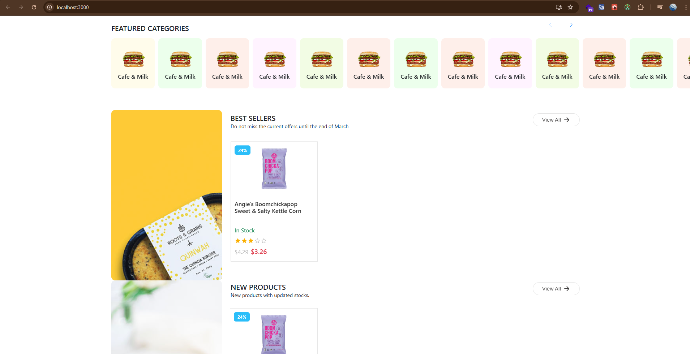
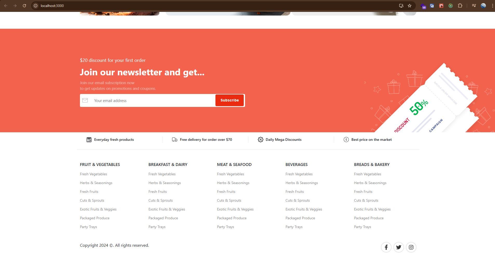
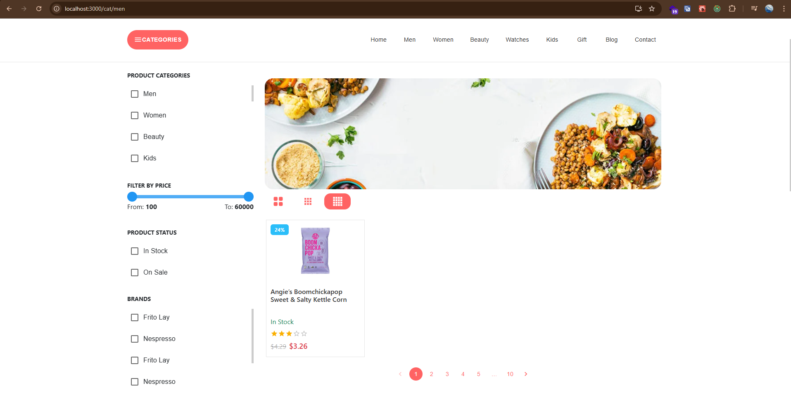
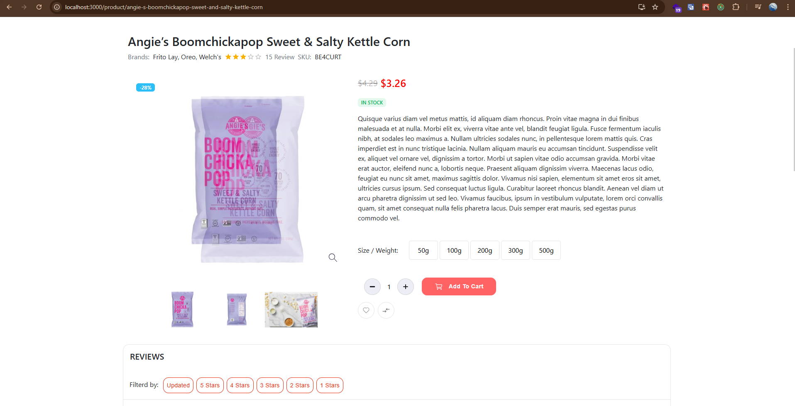

# 🛒 E-commerce Website using MERN Stack

A full-featured E-commerce web application built with the **MERN Stack** (MongoDB, Express.js, React.js, Node.js).

---

## 📚 Tutorial Source

This project was built for learning purposes by following the YouTube tutorial series by **Advanced UI Techniques** (https://www.youtube.com/@rinkuv37):
🔗 [E-Commerce Website Playlist (2024)](https://www.youtube.com/playlist?list=PLhFBHuT4t3aBL59pIGo13H4tUVzS_GlYm)
🔗 [React  Js Dashboard Tutorial | React Responsive Admin Dashboard with Material UI](https://www.youtube.com/playlist?list=PLhFBHuT4t3aApRKcTgTi3Sfu6zudkg7bW)

---

## ℹ️ Product Data Source

The product data used in this project is taken from the website:
🔗 [https://klbtheme.com/bacola/](https://klbtheme.com/bacola/)

Please note that the product information is for demonstration and learning purposes only.

---

## 🚀 Features

- User registration & login (with JWT)
- Product browsing, search & filter
- Admin panel to manage products
- Shopping cart functionality
- Order creation and checkout
- Data persistence using MongoDB
- Responsive UI with React

---

## 📸 Project Screenshot


### 🔹 Homepage




### 🔹 Category page


### 🔹 Product page


---

## 📦 Prerequisites

- [Node.js](https://nodejs.org/) (v16 or higher)
- [MongoDB](https://www.mongodb.com/) (local or Atlas)
- Git

---

## 📥 Installation & Run Instructions

### Clone the Repository

```bash
git clone https://github.com/dinhhuy12221/react-expressjs-e-commerce.git
cd react-expressjs-e-commerce